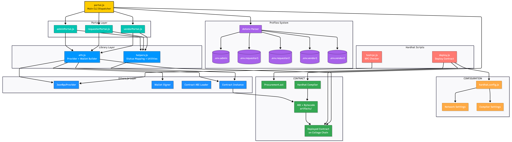

# EVERYTHING YOU NEED TO KNOW

Complete Technical Documentation for procurement-cli

This document explains the architecture, roles, workflow, data structures, profiles, contract state machine, CLI logic, and network configuration for the Institute Procurement Management System (Blockchain-based CLI).

It is intended for team members who need full understanding of how the system works.

---

## 1. Project Overview

This project implements a procurement process on a blockchain network using:

- College Blockchain network (custom RPC + chain ID)
- Solidity smart contract (Procurement.sol)
- Hardhat for deployment
- Node.js CLI portals for Admin, Requesters, Vendors

The system features immutable request tracking, tendering process, multi-party interactions, on-chain event logs, secure ECDSA-signed transactions, and decentralized auditability.

---

## 2. Roles in the System

### Admin

- Approves requests
- Views all requests
- Views bids
- Awards tender
- Pays vendor

### Requester

- Creates item requests
- Waits for approval
- Confirms received

### Vendor

- Views open tenders
- Places bids
- If awarded → delivers items

---

## 3. System Architecture

portal.js
├── portals/
│   ├── adminPortal.js
│   ├── requesterPortal.js
│   └── vendorPortal.js
├── lib/
│   ├── eth.js (provider, wallet, contract loader)
│   └── helpers.js (status names)
├── scripts/
│   ├── deploy.js
│   └── testrpc.js
└── contracts/
    └── Procurement.sol

---

## 4. Profiles System

Each actor uses a separate .env file:

Example:

NAME=Dept-CSE
ROLE=requester
PRIVATE_KEY=0x...
RPC_URL=<https://college-rpc>
CHAIN_ID=131313
CONTRACT_ADDRESS=0x...

This allows multiple requesters, multiple vendors, and one or more admins. The CLI dynamically selects the right environment per role.

---

## 5. Blockchain Network Details

Default: College Blockchain

Stored On-Chain:

- Request struct
- Bids
- Status
- Winner vendor
- Delivery flag
- Winning bid
- Requester address
- Vendor address

Not Stored On-Chain:

- Private keys
- Node.js logic
- CLI menus
- Internal metadata

---

## 6. Workflow (State Machine)

Created → Approved (Tendering) → Awarded → Delivered → Received → Paid

Requester:
→ Creates request → Waits
→ Confirms received

Admin:
→ Approves → Awards → Pays

Vendor:
→ Bids → Delivers

If admin tries to pay early → contract reverts `not received`.

---

## 7. Contract Storage Summary

Each Request has:

- uint id
- address requester
- string description
- uint estimatedAmount
- enum Status { Created, Approved, Tendering, Awarded, Delivered, Received, Paid }
- address winnerVendor
- uint winningBid
- bool delivered

Each Bid has:

- address vendor
- uint amount
- uint timestamp

IDs are automatically generated.

---

## 8. Project Dependency Graph

[Open full-size diagram](./images/procure-cli-workflow.png)

<[View it HERE](https://www.mermaidchart.com/d/a050d6cc-830e-4f67-b1e1-a4a0246e65b9)>

## 9. Procurement.sol Dependency Graph

[Open full-size diagram](./images/procure_sol-workflow.png)

<[View it HERE](https://www.mermaidchart.com/d/170eb783-4c14-4d3f-85cc-0a12b992dede)>

## 10. How the CLI Works

portal.js

- Shows role selection
- Loads profile
- Creates provider + wallet
- Passes control to the correct portal module
- Supports Back and Exit

adminPortal.js

- Reads all requests
- Shows details
- Approves
- Views bids
- Awards
- Pays vendor

requesterPortal.js

- Creates requests
- Lists own requests
- Shows details
- Confirms received

vendorPortal.js

- Sees open tenders
- Bids
- Delivers

---

## 11. Security Model

- All actions require private key signatures
- Private keys stored only in .env (never committed)
- Immutable ledger
- Prevents unauthorized state transitions (require checks)
- No one can see your Solidity source file on-chain

---

## 12. Supporting Other Networks

To use Sepolia, Hardhat Local, or Polygon:

Change this in all profile .env files:

RPC_URL=<new_rpc_url>
CHAIN_ID=<chain_id>

And add the network to hardhat.config.js.

---

## 13. Final Notes for Team Members

- CLI is modular and role-based
- Profiles allow unlimited users
- Everything on-chain is permanent
- Logic is enforced by contract rules
- College Blockchain avoids public RPC issues
- Admin cannot cheat due to contract restrictions
- System is fully auditable and transparent

---

``END OF EVERYTHING YOU NEED TO KNOW``
